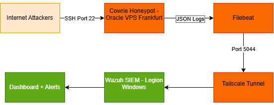

# 🛡️ Honeypot + SOC Lab

## Overview

A fully operational threat detection pipeline built to capture, analyze, and visualize real-world SSH attack data. A Cowrie SSH honeypot was deployed on an Oracle Cloud VPS in Frankfurt, Germany and left exposed to the public internet for 21 days. All 939,329 captured attack events were ingested into a self-hosted Wazuh SIEM via a custom Python indexing pipeline, analyzed with 18 purpose-built Python scripts, and documented in a formal threat intelligence report.

The honeypot attracted attacks from 2,685 unique IP addresses across 101 countries within seconds of deployment. Analysis identified six simultaneous, independent attack campaigns — including the mdrfckr botnet (1,342 compromised nodes, shared SSH backdoor key), a Mirai variant (confirmed C2 at 45.81.234.64), a bendi.py cryptomining dropper, and a komari-monitor deployment campaign.

**[Read the full Threat Intelligence Report →](docs/threat-report.pdf)**

---

## 🏗️ Architecture



```
Internet Attackers
       │  SSH Port 22
       ▼
┌─────────────────────────┐
│   Cowrie SSH Honeypot   │  Oracle Cloud VPS — Frankfurt, Germany
│   158.180.54.157        │  Ubuntu 22.04 LTS
└───────────┬─────────────┘
            │ JSON logs → Filebeat
            │ Tailscale tunnel (100.73.203.110 → 100.104.212.88)
            ▼
┌─────────────────────────┐
│   Wazuh SIEM            │  Local Workstation — Windows 11
│   Manager + Indexer     │  Docker Compose
│   + Dashboard           │
└───────────┬─────────────┘
            │
            ▼
  Real-time Alerts · Dashboards · Threat Intelligence Report
```

---

## Wazuh SIEM Dashboard

All 939,329 Cowrie events were indexed into OpenSearch and visualized in Wazuh:

**All Events — 939,329 total**


**Brute Force Attempts — 48,485 failed login events**


**Post-Login Commands — 84,082 command input events**


**File Downloads — 10,756 download events**


---

## Attack Visualizations

**Daily Attack Volume — May 2026**


**Hourly Attack Volume by Hour of Day (UTC)**


**Global Attacker Origins — 2,685 IPs across 101 Countries**


---

## 📊 Key Findings

> Full analysis in [docs/threat-report.pdf](docs/threat-report.pdf)

| Metric | Value |
|---|---|
| Total Events Captured | 939,329 |
| Unique Attacking IPs | 2,685 |
| Countries of Origin | 101 |
| Collection Period | May 13 – June 3, 2026 (21 days) |
| Peak Attack Day | May 25, 2026 — 429,301 events |
| Unique Usernames Tried | 2,125 |
| Unique Passwords Tried | 28,529 |
| RockYou Password Match Rate | 78.9% |
| Post-Login Sessions | 60,826 |
| Malware Samples Captured | 42 complete binaries |
| MITRE ATT&CK Techniques | 12 |
| Attack Campaigns Identified | 6 |

---

## Key Threat Intelligence Findings

### Six Simultaneous Attack Campaigns (Zero Infrastructure Overlap)

**Campaign 1 — mdrfckr Botnet**
- 1,342 compromised servers injecting an identical SSH backdoor RSA key
- Go-based custom toolchain (SSH-2.0-Go client fingerprint)
- 6,273 confirmed backdoor installations across the collection period
- No prior public threat intelligence reporting identified — original research

**Campaign 2 — Mirai Botnet Variant**
- C2 server at `45.81.234.64` (15/91 VirusTotal detections)
- Downloads architecture-specific binaries: armv6l, mips, mipsel, sh4, x86
- Operating under Minecraft hosting cover infrastructure (`panel.minesucht.eu`)
- Hardcoded credential `345gs5662d34` — Mirai family fingerprint

**Campaign 3 — Generic Credential Stuffing**
- 24,807 connection attempts via libssh_0.9.6-based tools
- 78.9% of passwords match the RockYou breach wordlist

**Campaign 4 — bendi.py Cryptomining**
- 290 automated deployments of a Python cryptominer dropper
- Full chain: apt-get → wget → execute → self-delete

**Campaign 5 — komari-monitor**
- 290 unauthorized deployments of legitimate server monitoring agent
- curl-pipe-to-bash installer bypasses file-based detection

**Campaign 6 — May 25 Carpet-Bombing**
- Two IPs generated 429,301 events in a single day (10x daily average)
- Nine consecutive hours of sustained high-volume brute force

### Credential Intelligence
- 93,976 login attempts across 21 days
- 78.9% of unique passwords found in RockYou breach corpus
- `345gs5662d34` — hardcoded Mirai credential, not in RockYou, 6,146 attempts
- `mdrfckr` username — zero false positive campaign indicator

### Infrastructure Analysis
- 99/100 top attacking IPs already flagged in AbuseIPDB
- Zero infrastructure overlap between any of the six campaigns
- C2 server `45.81.234.64` running under gaming hosting cover with EOL software

---

## Repository Structure

```
honeypot-soc-lab/
├── README.md
├── docs/
│   ├── threat-report.pdf          ← Full threat intelligence report
│   ├── architecture.md
│   ├── runbook.md
│   ├── attacker-map.png           ← GeoIP world map
│   ├── attack-timeline-daily.png
│   ├── attack-timeline-hourly.png
│   ├── wazuh-all-events.png
│   ├── wazuh-brute-force.png
│   ├── wazuh-commands.png
│   ├── wazuh-downloads.png
│   ├── virustotal-45.81.234.64.png
│   ├── ioc-ips.csv                ← 2,685 IPs with AbuseIPDB scores
│   └── ioc-urls.csv               ← Malware download URLs
├── honeypot/
│   ├── setup.md
│   └── sample-logs/               ← Anonymized real attack logs
├── siem/
│   ├── setup.md
│   └── rules/                     ← Custom Wazuh detection rules (200001-200011)
└── analysis/                      ← 18 Python analysis scripts
    ├── parse_logs.py
    ├── credential_analysis.py
    ├── command_tracker.py
    ├── mitre_mapping.py
    ├── geo_analysis.py
    ├── credential_intelligence.py
    ├── session_replay.py
    ├── find_downloads.py
    ├── find_client_versions.py
    ├── find_download_sessions.py
    ├── extract_ssh_keys.py
    ├── investigate_spike.py
    ├── timeline_graph.py
    ├── map_generator.py
    ├── ioc_export.py
    └── push_to_opensearch.py
```

---

## Technologies Used


| Component | Technology |
|---|---|
| Honeypot | Cowrie SSH Honeypot v2.9.19 |
| SIEM | Wazuh 4.9.0 via Docker |
| Cloud VPS | Oracle Cloud Free Tier (Frankfurt) |
| Log Shipping | Custom Python OpenSearch indexer |
| Tunnel | Tailscale |
| Analysis | Python 3.10 (18 custom scripts) |
| Threat Intel | AbuseIPDB, VirusTotal, ipinfo.io, Shodan |

---

## 🚀 Reproducing This Project

**1. Deploy the honeypot**
Follow [honeypot/setup.md](honeypot/setup.md) — complete step-by-step guide for Oracle Cloud + Cowrie.

**2. Deploy the SIEM**
Follow [siem/setup.md](siem/setup.md) — Wazuh via Docker on Windows.

**3. Connect the pipeline**
Follow [docs/runbook.md](docs/runbook.md) — Tailscale + Filebeat setup and activation.

**4. Run analysis**
```bash
cd analysis
python parse_logs.py --input ../honeypot/sample-logs/cowrie.json
python geo_analysis.py --input ../honeypot/sample-logs/cowrie.json
python credential_analysis.py --input ../honeypot/sample-logs/cowrie.json
python command_tracker.py --input ../honeypot/sample-logs/cowrie.json
python mitre_mapping.py --input ../honeypot/sample-logs/cowrie.json
```

---

## 📄 Threat Intelligence Report

The full threat intelligence report is available at [docs/threat-report.pdf](docs/threat-report.pdf).

Report sections:
1. Executive Summary
2. Methodology
3. Attack Overview
4. Attacker Profiling
5. Credential Analysis
6. Command Analysis
7. MITRE ATT&CK Mapping
8. Indicators of Compromise
9. Recommendations
10. Conclusion

---

## ✍️ Author

**Seif Allah Nazmy**
3rd Year Computer Science Student — Cybersecurity Track
German International University, Cairo

[](https://www.linkedin.com/in/seif-allah-nazmy-a80a75241)
[](https://github.com/seif999999)

---

## ⚠️ Disclaimer

This project is for educational and research purposes only. The honeypot is deployed on infrastructure owned and controlled by the author. All data collected is used solely for threat intelligence research. Ensure compliance with your jurisdiction and cloud provider terms of service before replicating this setup.
